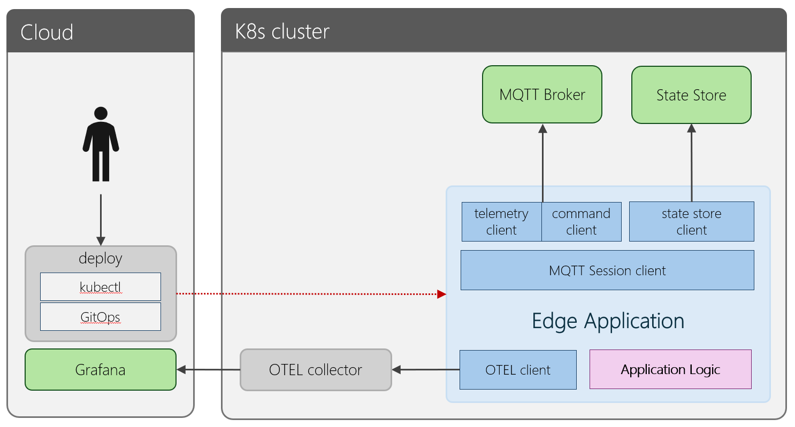

# Edge application development

Edge applications, are general purpose applications that run on the edge to perform a specific operations. This can be any arbitrary code, including the following scenarios:

1. **Data aggregation** - aggregate data at the edge to reduce volume before pushing to the cloud

1. **Local control** - add business logic to enable automated command and control at the edge for offline operations or reduced latency

1. **Monitoring** - monitor data and perform custom actions depending

1. **Integration** - integrate with existing on-prem systems

## Azure IoT Operations SDKs

The Azure IoT Operations SDKs supports building edge applications in a number of ways:

1. Provides a MQTT `session client` enabling simple secure connectivity to MQTT broker including automatic online credential renewal and session resuming on reconnection to minimum message loss.

1. The `state store client` provides a simple way to get, set and observe key-values

1. The `lease lock client` for sharing data between applications and supporting highly available application creation

1. The `telemetry client` for sending and receiving telemetry message

1. The `command client` for invoking and executing commands using RPC over MQTT

## Setup your environment

Developing an edge application requires a Kubernetes cluster with Azure IoT Operations deployed. Additional configuration will allow MQTT broker to be accessed directly from the developer environment.

> [!TIP]
> Follow the [setup instructions](/doc/setup.md) to setup your development environment and configure Azure IoT Operations.

## Creating your first application

Once your development environment is setup, its time to create your first application. The first step is to choose your preferred language. Currently the SDKs are available in .NET, Go and Rust.

To get started with your edge application, review the following steps to familiarize yourself with the available SDKs:

1. Review the various [components of the SDKs](/doc/components.md)

1. Refer to each language directory for instructions on setting up for that SDK and building your application:

   * [.NET SDK](/dotnet)
   * [Go SDK](/go)
   * [Rust SDK](/rust)

1. Learn how to [deploy](./deploy.md) your application to the cluster

1. Run the [Event driven app tutorial](/dotnet/tutorials/EventDrivenApp/) to gain an understanding on a simple edge application scenario

1. Review the [samples](/samples) directory for samples and tutorials
