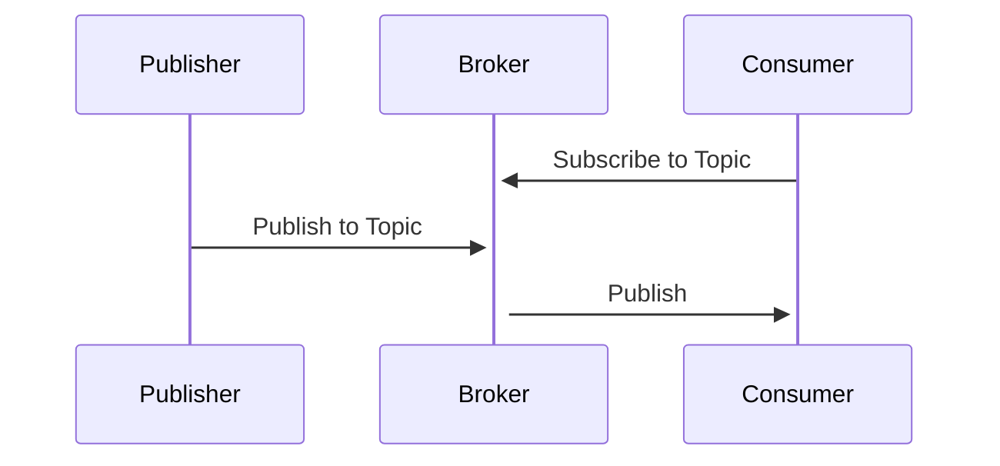
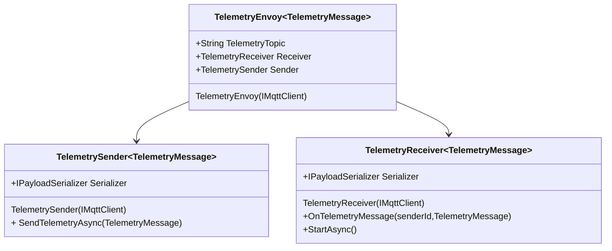
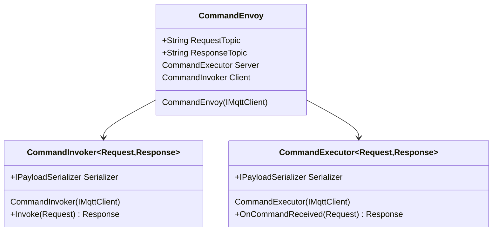
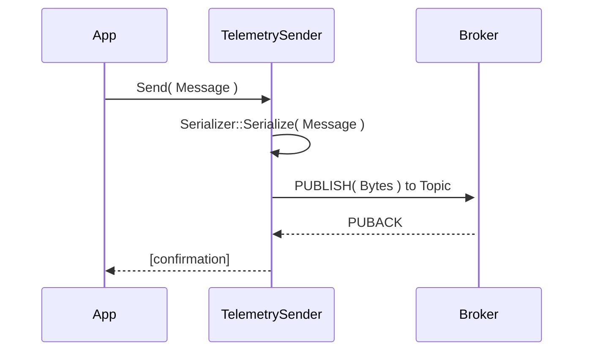
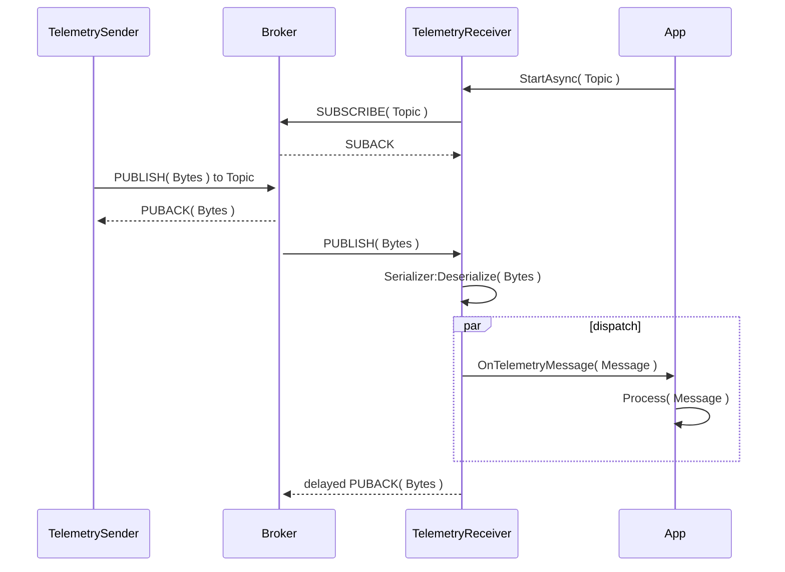
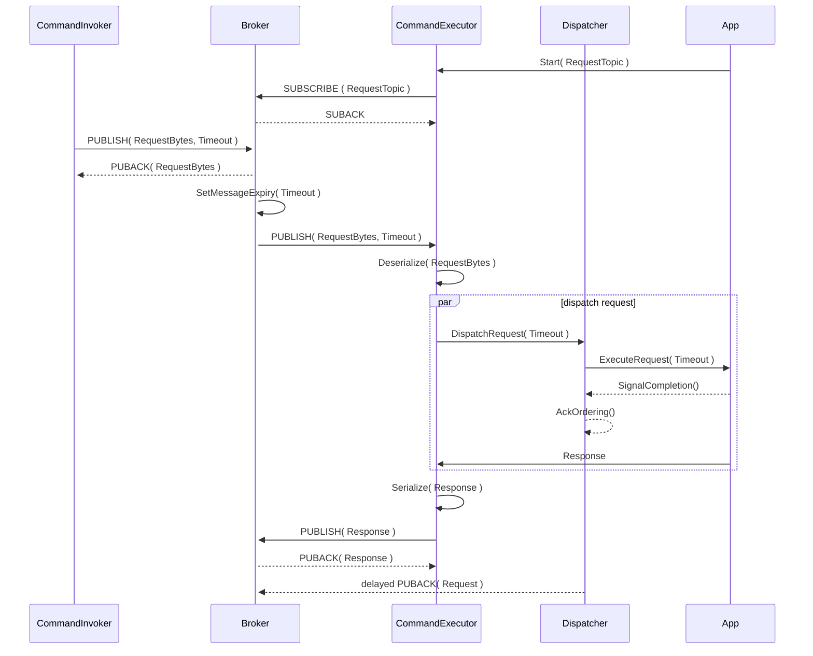
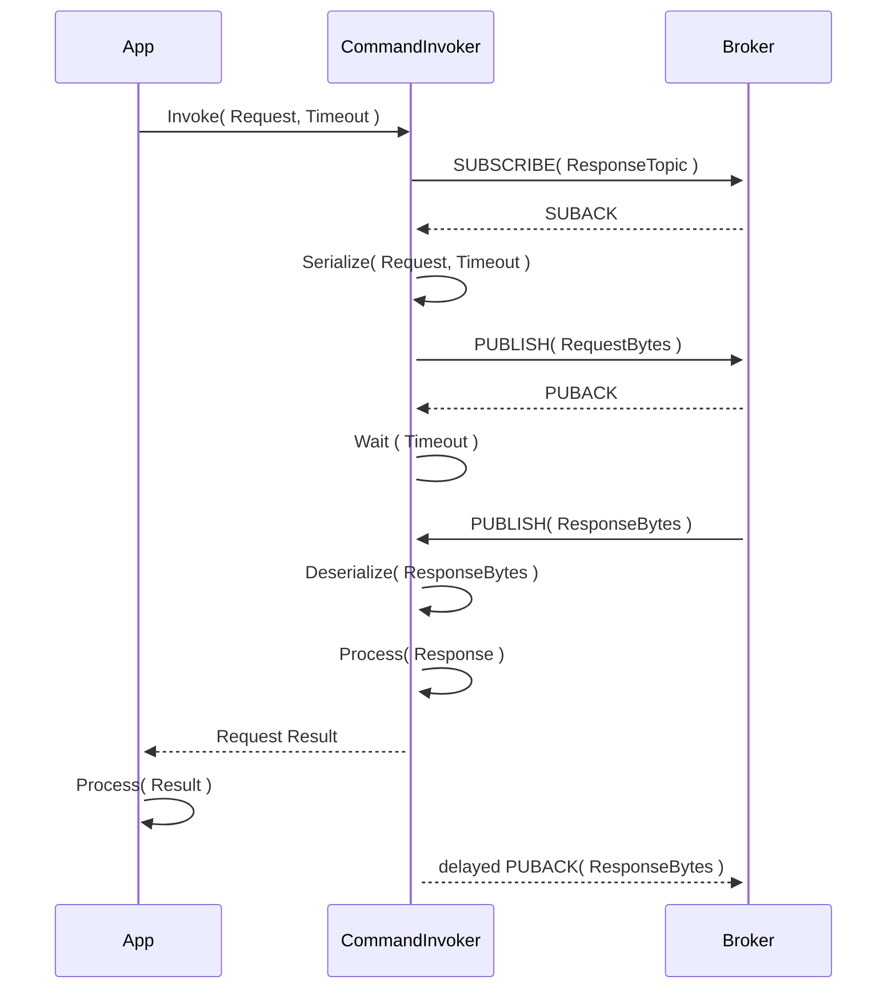

# Envoy with Binders

## Introdution

Pub/Sub applications enable to decouple the publisher from the consumer, hence there is a need to establish a contract defining the message sent to a given topic.

## Envoys

Each communication pattern requires a publisher and a consumer, the Envoy pattern establish the interaction with the broker from both sides, eg: The Telemetry Envoy will be composed of a TelemetrySender binder and a TelemetryReceiver binder.

### Telemetry Envoy

### Command Envoy

## Binders

A Binder is a pattern to encapsulates the app/broker interactions:

- Uses an MQTT client via dependency injection.
- Defines the topic to pub/sub.
- Defines the schema and serialization format.

Based on the communication patterns identified so far, there are 4 types of Binders

### Telemetry Sender

- **Telemetry Sender.** A sender binder implements a communication pattern where an application sends data to a broker topic, independently and unaware of who may be listening. 
This is a one of the most typical broker communication pattern with brokers, and in MQTT can be implemented with QoS0 or QoS1, depending on whether the application wants to have any guarantees that the message will be delivered to any listing subscribers, i.e., the message has been delivered to the broker. When using QoS0, the application is sending data in "Fire and Forget" fashion.

### Telemetry Receiver

- **Telemetry Receiver** A receiver binder usually works with the Sender, it subscribes to a topic, and triggers an event - often referred to as a callback or delegate - that includes the deserialized message that was sent to that topic. It may expose a _stream_ api to enable further processing of the messages. When using QoS1, the Receiver uses _delayed ACKs_ to take advantage of the broker capabilities with persistent sessions and implement guaranteed delivery.
To receive message from multiple clients, the receiver can use a _wildcard_ to subscribe to messages sent from multiple senders, this is messaging pattern is referred to as **Fan-in** or **many to one**. Telemetry receiver may use QoS1 and _delayed ACKs_ to ensure guaranteed delivery.

### RPC CommandExecutor

- **CommandExecutor** The CommandExecutor Binder listens to the Request Topic, deserializes the request and triggers an event that can be implemented by the user app to implement the command. Like the receiver binder, it may be configured to listen to different topics with _wildcards_. Once the command has been executed, the response will be serialized and published to the response topic. The CommandExecutor always uses QoS1, persistent sessions, and _delayed ACKs_ to take advantage of the broker capabilities with persistent sessions and implement guaranteed delivery of method invocations.

> Note. Omitted for brevity, the Dispatcher also works with an in-memory cache to de-duplicate requests resend on reconnection.

### RPC CommandInvoker

- **CommandInvoker** This binder is initiated by the user (as the Telemetry Sender), it will subscribe to the Response Topic, Serialize the Request and publish a message to the Request Topic. Since the response is not guaranteed, it should be configured with a Timeout. Once the response is received, it will be deserialized and sent back to the client. A command invoker uses QoS1, persistent session and _delayed_ ACKs to guarantee delivery of request and response.

