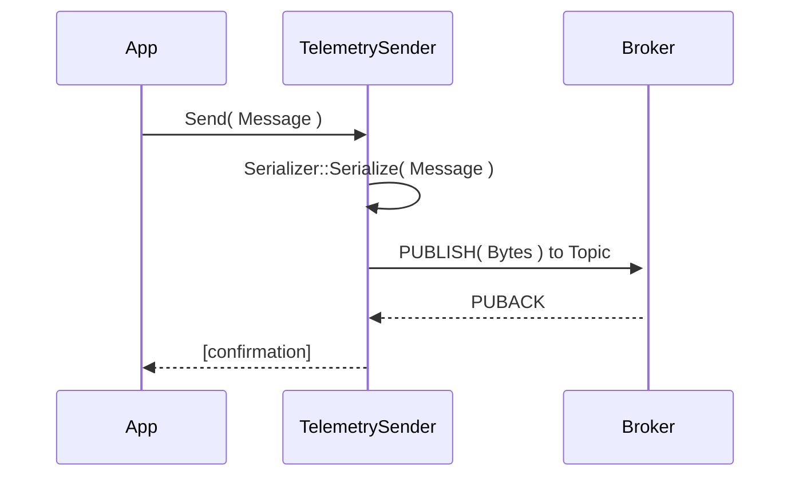
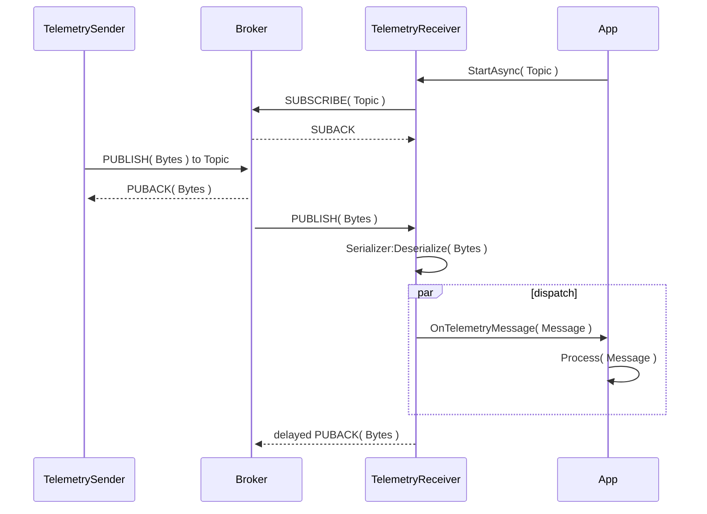

# Telemetry

## Telemetry Sender

A sender binder implements a communication pattern where an application sends data to a broker topic, independently and unaware of who may be listening. 

This is a one of the most typical broker communication pattern with brokers, and in MQTT can be implemented with QoS0 or QoS1, depending on whether the application wants to have any guarantees that the message will be delivered to any listing subscribers, i.e., the message has been delivered to the broker. When using QoS0, the application is sending data in "Fire and Forget" fashion.

## Telemetry Receiver

A receiver binder usually works with the Sender, it subscribes to a topic, and triggers an event - often referred to as a callback or delegate - that includes the deserialized message that was sent to that topic. It may expose a _stream_ api to enable further processing of the messages. When using QoS1, the Receiver uses _delayed ACKs_ to take advantage of the broker capabilities with persistent sessions and implement guaranteed delivery.
To receive message from multiple clients, the receiver can use a _wildcard_ to subscribe to messages sent from multiple senders, this is messaging pattern is referred to as **Fan-in** or **many to one**. Telemetry receiver may use QoS1 and _delayed ACKs_ to ensure guaranteed delivery.

