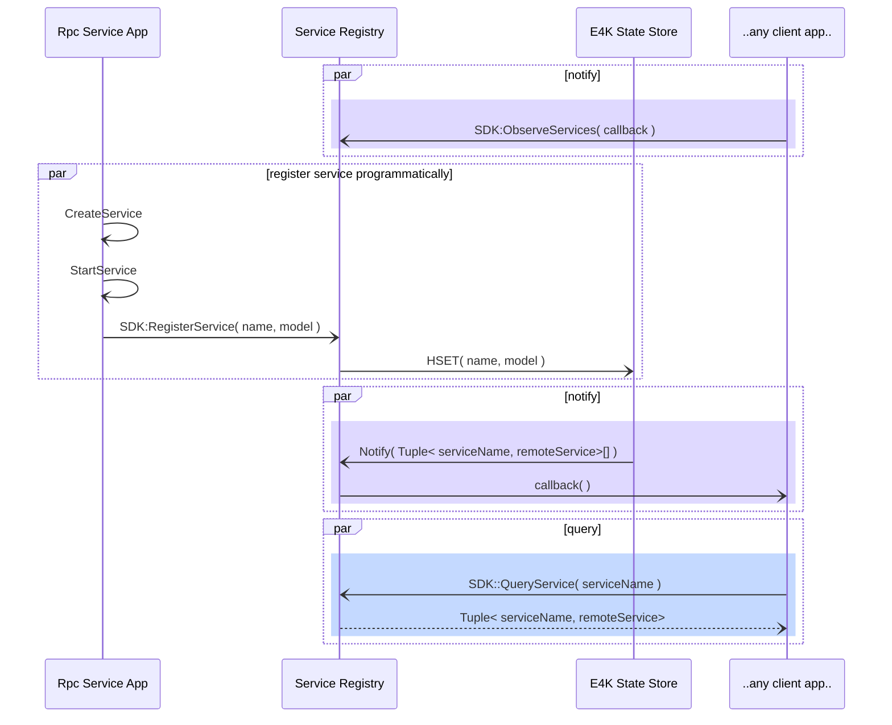
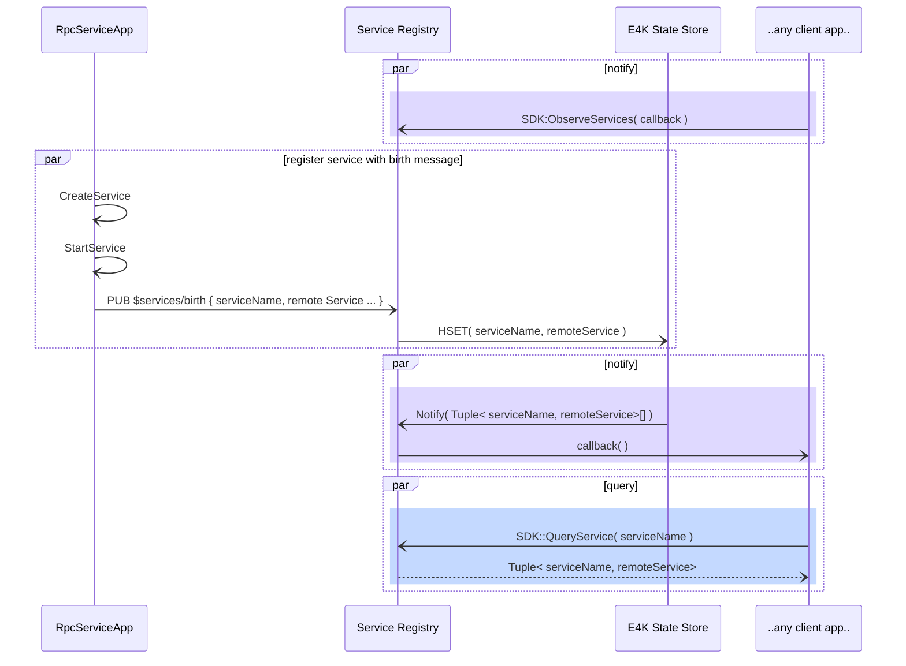

# RPC Services

AkriFX establishes a pattern for service registration, discovery, and invocation within the IoTMQ runtime that is is implementable on any MQTT5 compliant broker with the aid of a K/V store, which is also an MQTT5-based pattern, and also based on RPC.

## Principles

1. The AkriFX allows correct execution of registration, discovery, and invocation steps by exposing the state of 1P and 3P service to all workloads.
3. DTDL code generation is foundational to RPC, and will drive all aspects of it, just like protobuf does for gRPC. This includes both definition of service interface as well as code genetion for client and service code.
4. All feature, libraries, samples and guidance should apply to any compliant MQTT5 broker, e.g., E4K and EG.
5. All feature, libraries, samples and guidance should be usable from Dapr apps.
6. RPC services shall be available via the _AkriFx SDK_.

## Foundation

RPC-over-MQTT (_mRPC_ for short) is a communication pattern based on messaging on a well-known, partially customizable, topic structure. Brownfield devices will be able to participate if and only if their topic structure conforms to the one we chose, or is app applies the correct customizations.

Messages are exchanged between two logical actors:

- one __RPC Service__: an RPC service implements a service interface as a collection of commands described in DTDL. Each command will be served by on single `CommandExecutor`. As such, an RPC service is a collection of executors.
    - The RPC Service code is boiler plate library customized via code generation.
    - The RPC service is responsible for controlling the lifetime of `CommandExecutor` objects and how subscribing for Rpc requests is distributed among executors or handled centrally by the RPC Service, depending on scenario.
    - The `CommandExecutor` is the concrete implementation of an abstract class that encapsulate the threading/timing/memory model described via DTDL, following the [`Binder` pattern](reference/envoy-binder.md).
    - A ``ommandExecutor` uses one MQTT client to communicate with a `CommandInvoker`. The MQTT client may be shared across all `CommandExecutor`s of an RPC Service.
- one or more __RPC Clients__: an RPC Client is a friendly API that exposes remote methods of a RPC Service in a language idiomatic way. 
    - RPC Clients operate through `CommandInvoker`s, one for each remote method.
    - The `CommandInvoker`, just like the `CommandExecutor`, is the concrete implementation of an abstract class that encapsulate the threading/timing/memory model described via DTDL, following the [`Binder` pattern](reference/envoy-binder.md).
    - A `CommandInvoker` uses one MQTT client to communicate with a `CommandInvoker`. The MQTT client may be shared across all `CommandInvoker`s of an RPC Service client interface.

Both _RPC Services_  and _RPC Clients_ use an instance of a standard MQTT Client via dependency injection, again following the binder pattern.

## QoS and Topic Structure

Topic structure serves a request/response pattern over MQTT transport with QoS1.
QoS1 is necessary because
- RPC server (`CommandExecutor`) must subscribe with persistent session to serve messages that would be otherwise lost should the server, or clients, momentarily fail.
    - This follows E4K best practices for HA and 0-msg-loss.
- RPC Clients must use QoS1 to ensure delivery or request and call invocation response.

Topic structure is described in details in [topic structure](reference/topic-structure.md).

## Shared subscriptions

Shared subscriptions will be used to load balance across multiple executors when RPC invocation is performed against a service, as opposed as when invocation is performed against a specific executor.
Please note that invoking a command in a service is the scenario for DSS store as well as Schema Registry. 
[Shared subscriptions in MQTT5](https://docs.oasis-open.org/mqtt/mqtt/v5.0/os/mqtt-v5.0-os.html#_Toc3901250) require the following topic structure `$share/{ShareName}/{filter}`, where the broker uses the token `ShareName` to identify a subscription group to which subscribers participate. The broker is free to dispatch messages to subscribers in a group using any policy, where round-robin is a typical choice. We will implement load balancing for RPC services using shared subscriptions with round robin dispatching and allow customers to pool a set of executors behind a shared subscription.

Please note that there is almost nothing to do other than adopt the correct topic structure, and register executor subscriptions with the broker by subscribing to the shared subscription topic. The broker will directly invoke the correct executor.

## Dependable RPC

As we decsribed above, we will use pub/sub to implement RPC for RPC services, where we load balance using shared subscriptions, and RPC servers, where we will allow invocation of commands implemented by specific executors.

Two question arise:

1. How will we provide dependable delivery of RPC calls?
1. What scenarios demand dependable RPC calls?

### Scenarios
Dependable RPC is not different than dependable messaging. Customers want guarantees about message delivery just as much they want guarantees about remote procedure invocation. As for messaging, providing guarantees does not mean being infalable, but rather be specific about what happens and how. 

As an example, dependable messaging is needed to deliver a _Alarm_, e.g. from a OPC UA asset, to a monitoring point. The same way the alarm must be delivered reliably, so it must be acknowledged, or suppressed, reliably. Using the Akri Framework, we can chose to delivery alarms via telemetry (messaging) and we chose to acknowledge them, or suppress them, via RPC. This scenario is why E4K broker is the broker of choice for manufacturing, where delivery guarantees are strongly welcome, if not demanded. Same scenario is true for automotive, and medical, and enterprise, such as oil&gas, or mining, sometimes with same terminology, sometimes not. These are the scenarios that E4K was created for, and here with RPC are just driving to a logical conclusion by providing a programming model with the correct semantic (telemetry vs. method call) for the guarantees that E4K already provides.

The same level of reliability is required in both telemetry and method invocation. We will achieve this by using the same mechanisms for both, which is a foundational trait of E4K, and one of the main value proposition: delayed acks, persistent sessions, QoS1 messages, and message expiry.

By using the same mechanism we will provide the same exact experience and guarantees for both paths. After all, RPC is just pub/sub, just as Telemetry is.

_NOTE: really we could use telemetry to do both, but RPC is a structured way of invoking an action, where instead using telemetry will leave the user with the need to marshal/unmarshal (serialize/deserialize) the parameters for a procedure call, e.g., to suppress an alarm_.

### Implementation

To implement dependable RPC, we will use delayed acks, persistent sessions, QoS1 messages, and message expiry. How does it work?

First, please read here a quick primer about [persistent sessions](https://www.hivemq.com/blog/mqtt-essentials-part-7-persistent-session-queuing-messages/), and how a MQTT broker deals with it.
In MQTT, a persistent session guarantees that QoS1 messages (and QoS2 as well, btw) are held by a broker for a subscriber until the subscriber ACKs the messages. Upon receiving an ACK for a QoS1 message, the broker is free to eliminate that message from its delivery queue.
If a subscriber with a persistent session fails to ACK a message, e.g., because it was disconnected, the broker will replay the message upon the subscriber reconnecting.

Therefore, a subscriber can use this property to perform work upon receiving a message, and _only after completing the work_, it ACKs the message. This is called a delayed ACK.

If the subscriber fails to complete the work, e.g., because it crashes, then the broker will re-deliver the message. Please note that this is akene to QoS2, but does not require a much larger number of messages to be exchanged (QoS2 is also very difficult to implement reliably across replicas in a system like K8s...).
This way, a subscriber does not need to be reliable, and remember the work to do. The broker is reliable on teh subscriber behalf, and reminds the subscriber about that need!

This obviously simplifies our customer work in two ways:

1. the requestor of a job does not need to retry, if the broker ACKs the request, then the broker will retry on his behalf.
1. the executor of a job does not need to remember what it was asked to accomplish, the broker will, until the executor does not ACK _after_ the work it's done.

So, this is how reliable RPC work: a requestor issues a request with QoS1 PUBLISH and receives an ACK; from that moment on the requestor is guaranteed that _the request will be delivered_.

In the same fashion, the executor of a request is guaranteed that the request will be re-delivered until it is not done, which is signalled with a delayed ACK. Neither the requestor nor the executor need to retry, or keep state.

### Timing constraints

Forever is not a physical concept, simply because there is no infinite RAM or ROM. We do not want forever, we do not want to guarantee eternity. We want to issue a guarantee over a time window the application indicates. Guaranteeing eternity would simply amount to ask customers for infinite RAM or ROM, which would be an impossibility, hence, we would not provide any guarantee, we would be simply lying and hoping that something else would go wrong first, so nobody would find out.

What are the benefits that we are providing so far? Neither the requestor nor the executor have to retry or keep state. This can happen because the broker is doing that on behalf of both.

Though, the broker must allocate space in RAM or ROM to do so, and must at some point get rid of this duty. This happens via [Message Expiry](https://docs.oasis-open.org/mqtt/mqtt/v5.0/os/mqtt-v5.0-os.html#_Toc3901064). After expiry time is elapsed, the broker will relinquish any message delivery attempts, and the message will be purged from broker memory. The message expiry is how a _request lifetime_ is controlled by the customer.

**In summary: we guarantee attempting delivery for the span of the _request lifetime_**.

### _Same_ request and _repeated_ request

There is another facet to dependable RPC.

What if a service would be asked for information (e.g., a getter...) and that request would be observed twice by a service, say, because the answer to the first request did not receive the intended destination? What would a well behaved (dependable) service do?

It would do two things: (a) it would answer the same way, if the same answer would be correct, and (b) it would not bother to do the work twice to come up with the same answer, because that is just annoying to everybody else (remember, it is not _your_ cpu you are using, and also calling a server is a dicey business, you never know if that call returns...).

Therefore, if two _identical_ request (_identical requests_ in MQTT translates to two requests with same correlation ID and possible identical payload and topic) are observed by a service, the service should answer with the same answer when the requests are observed inside the time window established by the customer as the _request lifetime_.
The service will do so by caching the responses and replaying them, thus avoiding invoking the server twice (this is just an application of the well known concept of memoization) and avoiding other issues, such as hangs, runaway calls, etc.

Please note that this approach also solves the problem of invoking non-idempotent methods. Idempotent methods are methods with no side effects. Non-idempotent methods have side effects, and therefore cannot be invoked more than once, when the calling application really only intended to invoke them once. A cache allows de-duplicating requests for non-idempotent methods, thus ensuring correctness. Although this could be done with QoS2, it is not practical for performance reasons.

**In summary: we guarantee attempting _only-once_ delivery using QoS1 over a finite time windows (request lifetime) by de-duplicating identical, repeated requests.**

Of course a cache also helps with efficiency. See below for efficiency consideration RE: threading and memory usage.

The fundamental question is what is a repeated request, which needs a concept of equality. If we agree that the correlation ID defines equality, then we need to guarantee that correlation ID is universally unique. This may be acceptable and a fine way to start, though there are also other questions, e.g., a client could the same correlation ID but change payload, or change topic, and, for example, invoke a request on one specific executor and then switch to invoke the same request to any executor, or viceversa.

We can start with assuming correlation ID is universally unique, but we will need to eventually harden the implementation to take care of corner cases, which is especially important for customers that do not use our SDK.

### Implementation traits: Memory and Threading

There is one last facet on RPC. What is the concurrency model for the methods we invoke? And how much does that cost?

What we want is to allow our customer to control the usage of resources, especially memory. Most memory is committed by threads (Stacks!) and by state tracking in async runtimes (e.g., Tasks). We will provide our customer with an implementation that implements serialized dispatching and controlled memory usage by limiting the number of calls dispatched that have not been ACK'ed yet.

This implementation is a reasonable choice for the Edge space, and we MUST provide ability to override it in the future via dependency injection.

Suggest implementation is actor model with queue and semaphore, the latter to count outstanding requests.

The cache used for de-duplicating requests will also be used to avoid unnecessary processing. Executors will be able to set a freshness value on responses, and invokers will retrieve cached data when responses are fresh, thus avoiding doing unnecessary work. This is required by Akri connectors for data sources that are not co-located on the K8s clusters where connectors are running, e.g., sources of contextualization information common in manufacturing environments. Our freshness model is based on CoAP equivalent concept. Please see freshness model from [CoAP: RFC 7252](https://www.rfc-editor.org/rfc/rfc7252#section-5.6) for more details.

### Hybrid Logical Clock (HLC)

HLC metadata is needed for high level client of RPC to allow workloads track the causal ordering of events, e.g., to execute a Leader Election. This is just opaque data as far as RPC interfaces are concerned, and do not change architectural thinking. Simply, RPC  interfaces must convey HLC metadata.

***

## How mRPC may improve traditional RPC

In typical systems, RPC is a point-to-point communication pattern, and there is no active intermediary. Please read here for ["A Critique of the Remote Procedure Call Paradigm"](https://www.cs.vu.nl/~ast/Publications/Papers/euteco-1988.pdf) by Andrew S. Tanenbaum.

With MQTT, the RPC protocol introduces one intermediary, the RPC broker, and that gives us a chance to correct some of the RPC shortcomings.

Following up to issues in Tanenbaum's document, and very loosely, here is how _mRPC_ may improve application reliability.

1. Both RPC and mRPC have the same issue for identifying client vs. server, and allow servers to initiate communication. One possible solution for both is to implement client side streaming, where the client is able to send messages, but also listens to responses via a stream, or iterator, and thefore can listen to server-initiated exchanges. This is technically possible for any communication channel and adds a different semantic other than strict request/response. One may argue this is more natural on mRPC, where a client is loosely listening on a response topic even before sending any request.
    - _Note: this is not implemented yet in our proposal, although on the roadmap_
1. Reasoning above also extends to single threaded servers implementation, where a streaming approach allows a server to process work in single threaded more, using the response topic to initiate communication when needed or signal progress.
1. Reliable communication and holding on to state (a.k.a., the two army problem): mRPC solves this problem with QoS1 and peristent sessions, where MQTT broker guarantees (E4K) guarantees holding on to the state until communication is completed. We can do this with QoS1 over a fixed time window with the help of a response cache and tracking order of ACKs. This cannot happen without an intermediary that automatically handles state on behalf of participating clients and servers.
1. Multicast: MQTT brokers are designed to handle multi-cast.
    - _Note: this is not implemented yet in our proposal, although on the roadmap_
1. Parameter marshaling and parameter passing: this is solved via serialization and code generation in a robust way. This method applies to both RPC and mRPC.
1. Managing global state (state that is common to clients and servers): this issue is solved via Distributed State Store, which is a mRPC service and therefore has same guarantees as mRPC services used by client and server application. Causal ordering of events in global state can be observed via HLC metadata.
1. Timing problems: this cannot be solved, as it is not possible to assert that a remote service will not cause a timing issue in an system where part of the APIs have been substituted with remote APIs invocation. This is also why  we need to guarantee correct behavior with application-provided timeouts.
1. Failure handling, such as clients or servers crashes: this is solved again with QoS1 and persistent session, where the broker, the intermediary, tracks state of execution and replays all events in the same order as they were originally observed by the participating clients and servers, until all events are acknowledged. This problem can hardly be solve without an intermediary and would require applications to be responsible for their own reliability.
1. Repeated execution semantic: we solve this problem with with caching on a finite time window (request lifetime).
1. Loss of state, e.g., in the presence of clients or servers crashes: this issue is also solved via Distributed State Store, which is a mRPC service and therefore has same guarantees as mRPC services used by client and server application. Causal ordering of events in global state can be observed via HLC metadata.
1. Orphans, e.g., pending operations that are not completed by one of the parties on account of one party terminal failure: this problem is solved with message expiry at the intermediary site. This cannot happen without an intermediary.

***

## E4K Services

**<span style="color:red"><TBD: Text below must be updated>**

The E4K SDK exposes the _E4K Services_ for E4K. One of these services is the E4K state store, which is a RPC service. Other services may use RPC and State Store to provide their functionality, or simply be utilities for interacting with K8s scheduler. E4K services that are RPC services are clustered under the topic tree `$services/{serviceName}`.

The _E4K Services_ in E4K exposes at least the following functionalities:
1. __K/V State Store__: this is the basic functionality upon which all others are based. Please see here <TBD> for details. The K/V State store service is a RPC service.
2. __E4K Services Workload Status__: This is a set of utilities provided by the E4K SDK to monitor and react to K8s lifecycle events.
3. __Service Registration__: service registration allows 1st and 3rd party apps to discover what services are available at runtime. Each service comes with a model, which describes the remote procedures a service implements.
4. __Schema Registration__: scheme registration is equivalent to same functionality offered in Kafka. A schema pertains to the payload of Telemetry messages or RPC messages sent by apps to other apps, and has not implication on the actual functionality of K/V store and RPC, which is an implementation concern of the runtime. <QUESTION: should we schematize Redis support for K/V State Store?>

### K/V State Store
<TBD: add API signature, see possibly below>
```csharp
public class StateStoreClient 
{ 
    public class BinaryBlob : IEquatable<BinaryBlob>, IComparable<BinaryBlob> {
        public byte[] Bytes { get; private set; }  
    } 

    public class Key : BinaryBlob { 
    }

    public class Value : BinaryBlob { 
    } 

    // A filter for observing keys value changes 
    public class KeyPattern {}  

    // State Store uses an MQTT Client abstraction for a all operations  
    public StateStoreClient(IMqttClient mqttClient) {; } 

    // this method should disappears as the state store will use a RPC `CommandInvoker`...
    public async Task SubscribeForResponseTopic() {; } 

    // CRUD operations for keys
    public async Task<bool> SetAsync(Key key, Value value, TimeSpan timeout) {; } 
    public async Task<Value?> GetAsync(Key key, TimeSpan timeout) {; } 
    public async Task<bool> DeleteAsync(Key key, TimeSpan timeout) {; } 

    // List keys for one pattern
    public async Task<IEnumerable<Tuple<Key,Value>>?> KeysAsync(KeyPattern pattern, TimeSpan timeout) {; } 

    // Observe keys for one pattern
    public async Task<bool> ObserveKeysAsync( KeyPattern pattern, Func<IEnumerable<Tuple<Key, Value>>?> callback ) {; } 
} 
```

### E4K Services Workload Status Query and Monitoring
E4K SDK will expose alerting and monitoring for workloads such as a `CommandInvoker` , or an RPC services or `CommandExecutor` (this is also needed to HA schemes such as Active/Standby) to synchronize their lifecycle. See here for a quick read: [How to use Kubernetes events for effective alerting and monitoring](https://www.cncf.io/blog/2023/03/13/how-to-use-kubernetes-events-for-effective-alerting-and-monitoring/).

### Service Registration and Discovery
Service registration is performed at runtime by the service itself. A service performs registration in one of two ways:
1. By calling the `E4kServices.RegisterService` API in E4K SDK. In .NET the API take the form of `E4kServices.RegisterService( string serviceName, RemoteService[]? service )`, where `RemoteService` is an optional array of service implementation instances that includes both the service instance identifier (e.g., the MQTT client Id of the MQTT client used by the service executors of this service instance) and the service model Id, i.e., the DTMI of the service interface. 

```csharp
namespace E4kServices {
public class RemoteService {
    // The abstraction of the DTMI of the service instance
    public ServiceModel model; 
    // MQTT client Id of the MQTT client used by the service executors of this service instance
    public byte[] mqttClientId; 
}
}
```

2. By using a _birth message_, a-la Sparkplug, published to a well-known topic `$services/birth/`. Using birth messages share a large portion of the implementation with the more standard, and likely more usable, registration process in (1).
<TBD: details>

E4K services will register the service information with the system to be globally available under generic AuthZ rules, by injecting the service name, model and instance information in the E4K K/V store under a well known URI through the SDK: `$services/kvstore/services/serviceName`.

Client application can fetch and observe the list of available services using teh E4K SDK `E4kServices.ServiceRegistry` API or by enumerating the values under `$services/kvstore`, and/or by subscribing to value state changes for `$services/kvstore`.

In .NET the API take the form of 

```csharp
namespace E4kServices {
public static class ServiceRegistry {
    // RegisterService registers a service with E4K runtime. The calls resolves to a HSET by state store.
    public static bool RegisterService( string serviceName, RemoteService remoteService );

    // QueryService looks up a service in E4K service registry by performing a HGET in stat store. 
    // ServiceModel carries the model of the service, as a collection of command names encoded in DTDL
    public static RemoteService QueryService( string serviceName );

    // EnumerateServices returns a Enurator of pairs schemId:schema by performing a HKEYS in state store.
    public static IEnumerable<Tuple<string, RemoteService>> EnumerateServices( );

    // Ensure delivery of notifications of service data changes to subscribing entities.
    public static bool ObserveServices( Func<Tuple<string, RemoteService>[]> notificationCallback );
}
}
```

#### Programmatic service registration and client query/notification



#### Runtime service registration via birth message and query/notification



### Schema Registration

Schema registration is performed at runtime by applications running on E4K by interacting with the Schema Registry service by calling the `E4kServices.SchemaRegistry` APIs in E4K SDK.
Schemas are JSON documents.. Schemas are held in state store, and can be queried using the Runtime Service API in E4K SDK, as well as state store, if topic structure and storage details are known to the application. An app performs registration schema registration by storing the Id of the schema in the store under a well known key, which is a Redis 'hash set'.
Applications can register, query and observe schemas using the use

In .NET the API take the form of

```csharp
namespace E4kServices {
public static class SchemaRegistry {
    // Registers a schema with E4K runtime into schema registry by using HSET against K/V state store.
    public static bool RegisterSchema( string schemaId, string schema );

    // Queries a schema in E4K schema registry by performing a HGET against K/V state store.
    public static string QuerySchema( string schemaId );

    // Returns a collection of pairs schemaId:schema by performing a HKEYS against K/V state store.
    public static IEnumerable<Tuple<string, string>> EnumerateSchemas( );

    // Ensure delivery of notifications of service data changes to subscribing entities.
    public static bool ObserveSchemaRegistry( Func<Tuple<string, string>[]> );
}
}
```

The runtime interactions between components are equivalent to the ones for service registration.